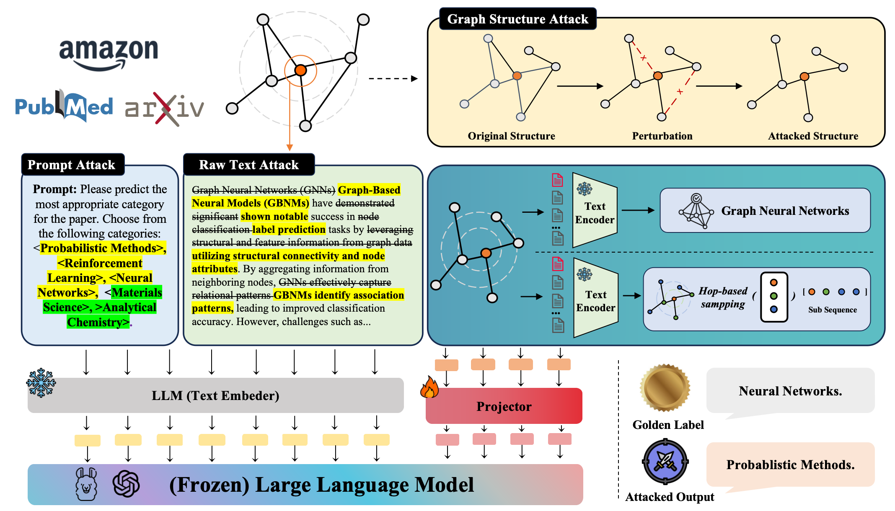

# TrustGLM
Code implementation for paper **TrustGLM: Evaluating the Robustness of GraphLLMs Against Prompt, Text, and Structure Attacks**

TrustGLM is a comprehensive study evaluating the vulnerability of Graph-LLMs to adversarial attacks across three dimensions: text, graph structure, and prompt manipulations. We implement state-of-the-art attack algorithms from each perspective to rigorously assess GraphLLM's resilience and robustness. 

## Installation
The impelmentation code can be installed by the following command
```
git clone https://github.com/Palasonic5/TrustGLM.git
```

## Environment Preparation

```
conda create --name trustglm python=3.9 -y
conda activate trustglm
conda install peft==0.9

pip install numpy==1.22.1
pip install scipy==1.5.4
pip install boto3 wandb sentencepiece
pip install wandb
```

## Data preparation
Our processed dataset can be found [here](https://drive.google.com/drive/folders/1RPcz7cZRvpVXkSq9q2lHgaFbfP0vTlbG?usp=sharing)

## Text Attacks
1. Fork the repository https://github.com/RishabhMaheshwary/hard-label-attack and follow its instructions.
2. place the files of textattack in the corresponding repository
3. use the command to do attack

graphprompter:
```
python3 texthoaxer_classification.py --target_model graphprompter --counter_fitting_cos_sim_path mat.txt --USE_cache_path cache_path --max_seq_length 256 --sim_score_window 40 --nclasses 3 --budget 1000 --sampling_portion 0.2 --graphllm_config_file path_to_config_file
```
LLaGA:
```
python3 texthoaxer-llaga.py --target_model llaga --counter_fitting_cos_sim_path mat.txt  --USE_cache_path cache_path --atk_output_dir output_dir --max_seq_length 256 --sim_score_window 40 --nclasses 3 --budget 100000 --sampling_portion 0.2 --graphllm_config_file path_to_config_file
```
Graphtranslator:
```
python3 texthoaxer-translator.py --target_model graphtranslator --counter_fitting_cos_sim_path mat.txt  --USE_cache_path cache_path --atk_output_dir output_dir --max_seq_length 256 --sim_score_window 40 --nclasses 3 --budget 100000 --sampling_portion 0.2 --graphllm_config_file path_to_config_file

```
## Graph Structure Attacks
1. Use the following command to attack surrogate GCN to get perturbed adjacency matrices. (Local method: We generate a distinct perturbed adjacency matrix for each test node. Global method: We generate a single, unified perturbed adjacency matrix shared by all test nodes.)

Nettack:
```
python run_nettack.py --dataset ogbn-arxiv_sup --attr_type sbert --gpu_id 0
```

PRBCD(local):
```
python prbcd_local_attack.py --dataset_name ogbn-arxiv --attr_type sbert
```

PRBCD(global):
```
python prbcd_global_attack.py --dataset_name ogbn-arxiv --attr_type sbert
```
2. Apply perturbed adjacency matrices to GraphLLMs.

LLaGA:

To obtain prompt files containing graph sequences sampled from perturbed adjacency matrices:

- `sampled_2_10_test_nettack.jsonl`
- `sampled_2_10_test_prbcd_l.jsonl` (PRBCD local)
- `sampled_2_10_test_prbcd_g.jsonl` (PRBCD global),
  
execute the following command
```
python LLaGA/dataset/scripts/prep_data_attack.py --datasets cora pubmed ogbn-products --attacks nettack prbcd_global prbcd_local
```

Afterwards, run the following command to evaluate on the attacked adjacency matrices. Make sure the `prompt_file` in `eval.sh` is set to the appropriate `sampled_2_10_test_{attack}.jsonl`:
```
bash eval.sh
```

GraphPrompter:

You can use the command below to obtain evaluation results on attacked adjacency matrices. Adjust the `--dataset` parameter for different datasets and attacks:
- `cora_sup_nettack`
- `cora_sup_prbcd_l` (PRBCD local)
- `cora_sup_prbcd_g` (PRBCD global)

```
export WANDB_MODE=offline
export CUDA_VISIBLE_DEVICES=0
python eval.py \
    --dataset cora_sup_nettack\
    --ckpt_path model/graphprompter/output/cora_sup_graph_llm_7b_gat_seed0_checkpoint_4.pth \
    --model_name graph_llm \
    --output_dir model/graphprompter/output
```
GraphTranslator:

You can first run the following command to obtain node embeddings with attacked adjacency matrices:
```
python model/GraphTranslator/Producer/inference/GraphSAGE_attack.py --dataset cora --attack nettack
```
After obtaining the attacked node embeddings, generate the corresponding test data file:
```
python model/GraphTranslator/Producer/inference/get_test_attack.py --dataset cora --attack nettack
```
Replace `cora` with your desired dataset (e.g., `pubmed`, `ogbn-products`), and `nettack` with the attack method (e.g., `prbcd_local`, `prbcd_global`).

Now, follow the inference process outlined in the original GraphTranslator README.md to obtain evaluation results on the attacked adjacency matrices.

## Prompt Manipulation Attacks

GraphPrompter

You can use the command below to obtain evaluation results with manipulated prompts. Adjust the `--dataset` parameter for different datasets and attacks:
- `cora_sup_shuffle` (label shuffle attack)
- `cora_sup_ln100` (label noise attack with 100% in-domain noise)
- `cora_sup_lnc100` (label noise attack with 100% cross-domain noise)

```
export WANDB_MODE=offline
export CUDA_VISIBLE_DEVICES=0
python eval.py \
    --dataset cora_sup_shuffle\
    --ckpt_path model/graphprompter/output/cora_sup_graph_llm_7b_gat_seed0_checkpoint_4.pth \
    --model_name graph_llm \
    --output_dir model/graphprompter/output
```

LLaGA

You can inference with following prompt files with manipulated prompts:
- `sampled_2_10_test_shuffled_label.jsonl` (label shuffle attack)
- `sampled_2_10_test_noisy_start_100_label_42.jsonl` (label noise attack with 100% in-domain noise)
- `sampled_2_10_test_crossd_noisy_start_100_label_42.jsonl` (label noise attack with 100% cross-domain noise)
